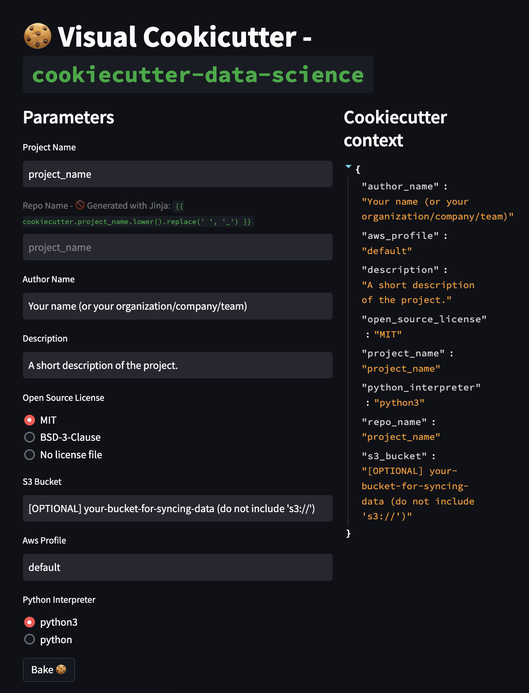

# Visual Cookiecutter 🍪🖼️

Bake cookiecutter templates visually (with a web UI).

Visual Cookiecutter package also provides enhanced features over the regular
`cookiecutter` package, such us:

- Required fields
- Conditional input parameters
- Optional descriptions for parameters
- Easily fix mistakes/typos on previously introduced parameters' values.

## What "Visual Cookiecutter" is?

Visual Cookiecutter is a small Python package which lets the developers
instanciate (or bake) `cookiecutter` templates in a snap! With its sleek and
modern interface built on top of `streamlit`, Visual Cookiecutter provides a fresh
and intuitive user experience.

Say goodbye to the tedious process of filling up `cookiecutter` parameters data
through a terminal and hello to a visually appealing frontend that will make
template instantiation a breeze. Our software is designed to seamlessly integrate
with `cookiecutter`, so all cookiecutter templates work out-of-the-box. See the
example below with [cookiecutter datascience](https://github.com/drivendata/cookiecutter-data-science).

## Unique features

Visual Cookiecutter is a powerful tool that extends the functionality of the
popular template generator, Cookiecutter. Its unique features offer several
advantages to template creators. Let's take a closer look at some of these features.

To show off the unique features we will follow the [sandbox](/sandbox/) example
that you can find in the root of the repository.

- Conditional `file_name` and `name`: Visual Cookiecutter allows you to define
conditional prompts parameters. These prompts are only asked when
a parameter matches a given condition (in this case when `create_file` is set
to "yes") in the `_viz_context` field. This allows you to create more dynamic
templates.

- Description for `create_file` parameter: In addition to conditional prompts,
Visual Cookiecutter also allows you to add descriptions for each parameter in
your template. This can be particularly helpful for the `create_file` parameter,
as it can provide additional context to the user about what this parameter does
and how it affects the template generation process.

- Unmodifiable field `sub_folder`: Visual Cookiecutter also generates the
`sub_folder` field automatically using the given JINJA template. This field
cannot be modified by the user, which ensures a consistent value for the
propmpt.

Have a quick look how the processes of "baking" the "sandbox" template looks
like:

```bash
$ viz-cookiecutter sandbox
```


The used JSON file to generate the above UI.

```json
{
    "folder_name": "folder",
    "sub_folder": "{{ cookiecutter.folder_name.upper() }}",
    "create_file": ["yes", "no"],
    "file_name": "file",
    "name": "guillem",
    "_viz_context": {
        "is_required": ["folder_name"],
        "descriptions": {
            "create_file": "Whether or not create a file containing the user name provided in the `name` parameter."
        },
        "if": {
            "create_file": {
                "is": "yes",
                "ask_for": ["file_name", "name"]
            }
        }
    }
}
```

## With existing Cookiecutter Templates (Data Science 🧠)

```bash
$ viz-cookiecutter https://github.com/drivendata/cookiecutter-data-science
```


